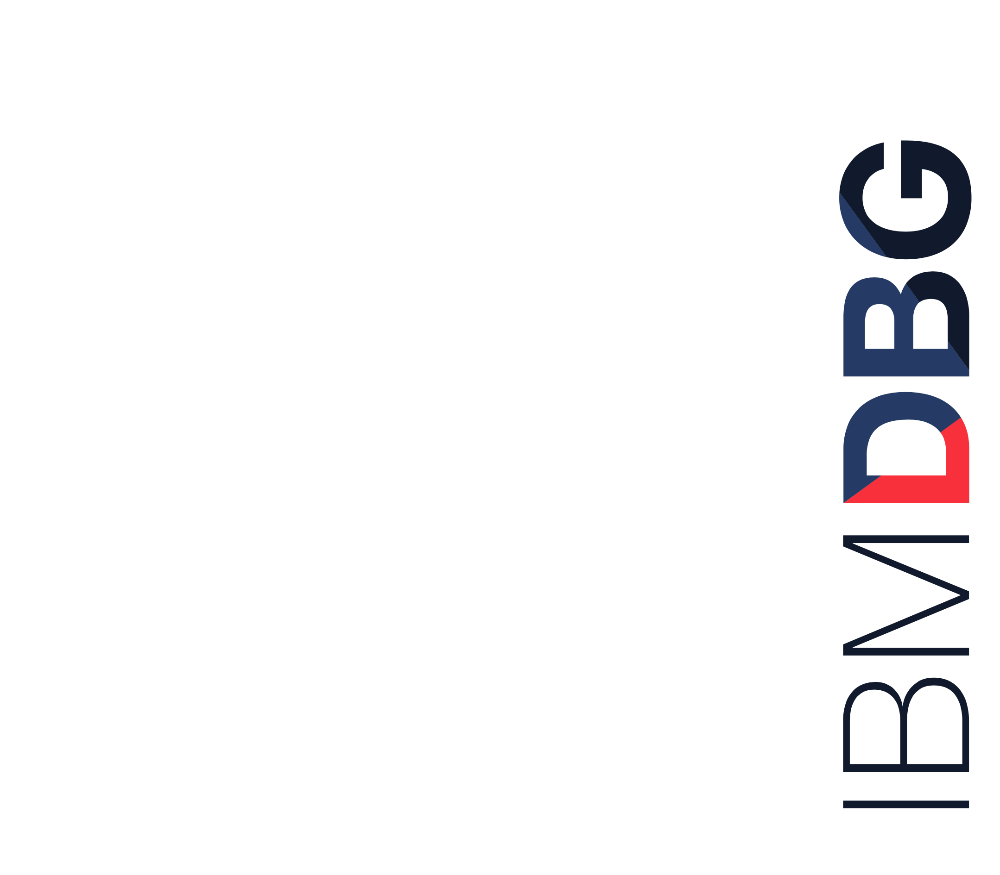

# Automate the decision-making process using Machine learning with minimal manual intervention

Offering Managers: 

Development: 

Month Day, Year

&nbsp;
&nbsp;
&nbsp;
&nbsp;

## Overview

The decision-making process involves a choice from a number of alternatives. This Code Pattern discusses how Decision Tree Classification model  (Machine Learning) can be used to overcome these challenges and reduce the manual intervention involved in day to day decision making process in business. And, Then finally finding the optimal path to recommendation by traversing the decision tree.  

## Architecture Diagram

## IBM Products

* Watson Studio
* Cloud Object Storage

## Related Technologies

* Python, Object Storage, Data Science, Machine Learning

## Key Features

* Decision Tree, Tree Traversal, Decision Making, Recommendation System

## Rationale

In the decision making process, we choose one course of action from a few possible alternatives. In the process of decision making, we may use many tools, techniques and perceptions. In the Multinational Companies, Banks or Hospitals, the decision-making process could be quite complex, difficult to manage and time-consuming. This Code Pattern will showcase how to automate the process of decision-making using Machine Learning with minimal manual intervention. The Pattern demonstrates the strategy using the Travel Process data. However, The strategy can used for any decision-making Process.

## Code Pattern Hypothesis

### Opportunity

* This Code Pattern targets developers wishing to leverage Watson NLU capabilities and Watson Studio services

### Operational Efficiency

* Data processing (Process the structured Travel-data and handle empty values in the data)
* Data Cleaning
* Building a decision-tree model.    
* Optimal path Traversal of  the tree 
* Algorithm to get the right decision from the set of answers to the questions entered by the user.

### Advocacy Potential
* Data Scientist 

### Amplification

### Competition

## Concept

### What is the Code Pattern?

This code pattern analyses the entire data fed by user,  match it with the model, and find the optimal path of  the process to the appropriate decision. Henceforth, the Code Pattern will not only showcase how to automate but optimize any process of decision-making using Machine Learning with minimal manual intervention. It demonstrates the strategy using the Travel Process data. However, The strategy can extended to and used for any decision-making Process.

### Who is it for?

Data scientist, Software developers, Managers and other Professionals working at the companies having complex decision-making process management.

### What will they learn?

* Build Decision Tree Classification Model in Scikit-learn.
* Decode a built Decision Tree for traversal. 
* Find optimal possible paths leading to a final decision/ recommendation.
* Learn the Strategy to get the correct recommendations.

## What does it look like?

# Strategy

## What is the strategy?

* From the past travel process data, a decision tree classifier is trained. 
* The Algorithm first  takes the feature and its  value from the user. For instance, a user says “the estimated cost of its travel is $500.”
* The Algorithm will look up the Decision Tree model and will search for the optimal possible paths which can lead to the decision/ recommendation.
* Then the system will start question relevant questions from the user and based on the answers given by users. A decision is recommended.

## What is the advocacy potential?

This Code Pattern will give Developers, Data Scientists a new wave of thought on how to automate the decision-making processes in the businesses which can save them plenty of resources and time.

## What are some target events or meetups?

## How does this impact the city and community Heat Maps?

## What are the key metrics for this Code Pattern?

1. \# Github repo forks, stars, pull requests
2. \# Number of meetups, Conferences, presentations

